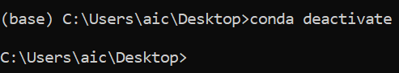
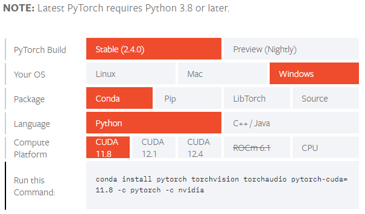

# 00-Introduction, Setup  

## Introduction  
$\textbf{Course}$  
Deep Learning for Computer Vision (August 2024)

$\textbf{Programming Language}$  
Python3  

$\textbf{Lecturer}$  
Assoc.Prof. Dr.Mongkol Ekpanyapong  

$\textbf{Teaching Assistant}$  
Lin Tun Naing  

$\textbf{Lab Session Outlines}$  
00 - Introduction and Setup  
01 - Python Basics  
02 - Deep Learning and Neural Networks  
03 - Basic Convolutional Neural Networks and Pytorch  
04 - AlexNet and GoogLeNet  
05 - ResNet and SENet  
06 - YOLO  
07 - Mask R-CNN and UNet  
08 - Vision Transformer  
09 - Generative Adversarial Networks  
10 - 3D Deep Neural Networks  
11 - Contrastive Language-Image Pretraining  

$\textbf{References}$  
- https://github.com/Alisa-Kunapinun/Deep-learning-for-Computer-Vision-Aug-2022  by Dr.Alisa Kunapinun
- https://github.com/dsai-asia/RTML/  by Prof.Matthew N. Dailey
- https://www.learnbyexample.org/python-introduction/
- https://www.geeksforgeeks.org/  
- Coursera - Deep Learning Specialization  
- ChatGPT

## Setup  
When you start the setup from the scratch with any of Windows, Linux or Mac OS, you are recommended to install the following:  
- Python3 Latest (required)
- Conda Environment (miniconda: recommended)
- PIP (required even if you are using conda environment)
- Python Libraries
- Git Installation

### Python3 Installation  
- If you have Nvidia GTX or RTX GPU built-in your laptop, you can use your **Own Laptop** throughout the course.  
- If you don't have Nvidia GTX or RTX GPU in your laptop, it is recommended to use your **Google Colab** instead since GPU processing is required in most deep learning trainings.  
- We will use **Python3** throughout the lab. If you have lower versions of Python such as Python2, you have to install Python3 since a lot of syntaxes are different.  
- To install Python3 package in your machine, please follow below instructions according to your OS.

**For Windows Users**
- Check the type of your processor architecture using `systeminfo | find "System Type"`
- Go to https://www.python.org/downloads/windows/ and download the installation package (.exe file) according to your architecture type. 
- You can also check `python` or `python3` in your (conda prompt) terminal or command line before installing Python3 in your laptop. It will prompt you to the Python3 interpreter.  
- To exit from Python3 interpreter, simple type `exit` or `exit()`.

 

- While installing Python from `.exe` file, make sure you tick the add Python to PATH box or you will not be able to access Python from the windows terminal.  

 

- Next, you need to install PIP(Preferred Installer Program) or Conda (miniconda or Mamba or Anaconda) in order to easily install python packages. To do so, follow the instructions from https://www.geeksforgeeks.org/how-to-install-pip-on-windows/.

**For Linux Users**
- For Ubuntu users, you don't need to install Python as it has been built-in in OS package already.  
- In order to check whether you have python3 installed, you can check `python` or `python3` command in your terminal and it will prompt you to the Python3 interpreter as shown in below image. Otherwise, you need to install Python3.
- To exit from Python3 interpreter, simple type `Ctrl+z` or `Ctrl+d`.

 

- For installation, go to terminal and run the commands:
    - `sudo apt-get update && sudo apt-get upgrade -y`
    - `sudo apt-get install python3` or if you want to install specific version, type: `sudo apt-get install python3.xx.x`
- To install Python Build Dependencies, run the command:
    - `sudo apt-get build-dep python3`
- You can also install some useful modules by running the command:
    - `sudo apt-get install build-essential gdb lcov libbz2-dev libffi-dev libgdbm-dev liblzma-dev libncurses5-dev libreadline6-dev libsqlite3-dev libssl-dev lzma lzma-dev tk-dev uuid-dev zlib1g-dev`
- Next, you need to install PIP(the Packages Installer for Python) in order to easily install python packages. To do so, run the command `sudo apt-get install python-pip` or `sudo apt-get install python3-pip`

**For MacOS Users**
- Please follow the instruction from https://www.datacamp.com/blog/how-to-install-python.  

**Conda Installation for All Users**
- To check Python version in terminal: `python --version` or `python -v`
- To install miniconda, please follow the instructions from https://docs.anaconda.com/miniconda/#miniconda-latest-installer-links and select the download file according to your operating system.
- Don't forget to add Miniconda into PATH Environment Variable. See the figure below:

  

- Once installed miniconda, you will be able to run conda command in the Anaconda Prompt (miniconda).
- In the Anaconda Prompt, you are directed to the conda (base) environment. If you would like to create your own custom environment, you need to first exit the default (base) environment using `conda deactivate` command.

 

- After you get out of the default env, in order to create a custom env name eg.`myconda` with built-in python installed, use the command `conda create -n myConda python` or specify the version of python `conda create -n myConda python==3.12.4`.
- `conda env list` command will show all the conda environments you have in your machine. You can simply activate the environment using `conda activate EnvName` eg. `conda activate myConda`.

 

- To check installed python packages in the terminal, please use the command `conda list` for conda.
- To install a python library or package from conda: `conda install package_name`, eg. `conda install numpy`
- To install jupyter notebook: `conda install jupyter`.
- To run jupyter notebook, open terminal and go to the directory you want to run jupyter notebook, type the command `jupyter notebook`

**CUDA Toolkit and CuDNN Installation with Conda**
- Before installing the CUDA, first check your available GPU whether it is compatible with CUDA installation. Try `wmic path win32_VideoController get name` in your terminal and check if your GPU is NVIDIA RTX or GTX Series. Mac users or the users with GPUs other than NVIDIA RTX or GTX Series are not compatible with CUDA.

 

- If your machine is compatible, run `conda install -c conda-forge cudatoolkit` and then `conda install -c conda-forge cudnn` inside your conda environment. The latest version of CUDA Toolkit in conda-forge to date is cudatoolkit-11.8.0 and that of CuDNN is cudnn-9.2.1.18.

**Pytorch Installation**  
- Another important package is Pytorch. You can follow the instructions from https://pytorch.org/get-started/locally/ and install with CUDA versions(here in conda env, we have CUDA 11.8).

 

- Those who are not using the CUDA, you can simply use the CPU Pytorch Installation.
- Finally, in Python Interpreter, type `import torch`, then `torch.cuda.is_available()` will return `True` for the CUDA users and `False` for the CPU users.

 

**Some Other Useful Packages You Might Want to Install**
The followings are some important packages or libraries however most of them are sometimes dependencies of other packages that you have installed. But make sure that you can handle the version mismatch issue properly while installing the python libraries and dependencies.
1. numpy
2. pandas
3. matplotlib
4. seaborn
5. opencv
6. setuptools

### Git Installation

Please follow the instruction from below link. Complete until the step 3. If you want to understand more about Git, you can complete all steps but not necessary. 
It is recommended to create the Git account with your own personal email address since you will be using throughout your career even after your degree.  
https://www.freecodecamp.org/news/introduction-to-git-and-github/  

### How to Clone a Git Repository

https://git-scm.com/book/en/v2/Git-Basics-Getting-a-Git-Repository

Follow the above link and try cloning my Deep Learning for Computer Vision Lab Repository.  
https://github.com/l-kuo/DLCV-Lab  

## Get Familiar with a Computer Vision Model (Object Detection and Classification)
Now we are going to play around with a famous Object Detection Model called YOLO(You Only Look Once). Different versions of YOLO have been released from different authors. Here, we are going to use YOLOv8 Model which is easy and accurate for object detection and classification. In order to execute the YOLOv8 Model, we need to install a library called Ultralytics from https://docs.ultralytics.com/quickstart/.

- Create a file named yolov8_inference.py (.py extension) and paste the following code inside the file and save it.
- You can run the python extension file in the commandline or terminal using `python yolov8_inference.py`.
- It will show up the results like below. If you pass the video file or even livestream, the model can detect and classify the objects in real-time.

   

#### How to Put a Screenshot in Jupyter Notebook Markdown

The following steps are the easiest way to put a screenshot in your Jupyter Markdown cell.  

##### Step1
- Add a new cell at a location where you want to put the screenshot. Notice that you have to select an existing cell before adding. A new cell will appear just below the cell you selected.

   

##### Step2
- Select the new cell and change the type of the cell by choosing "Markdown" on the task bar dropdown.

   

##### Step3
- Under the "Edit" tab, choose the "Insert Image" while selecting the cell.

   

##### Step4
- Click on "Choose File" and select your screenshot from your local directory. Then click "OK".

   

##### Step5
- When you have selected the screenshot image, the script inside the red rectangle will appear automatically. Once you run the cell, you will get the screenshot image shown in your markdown file.

   

