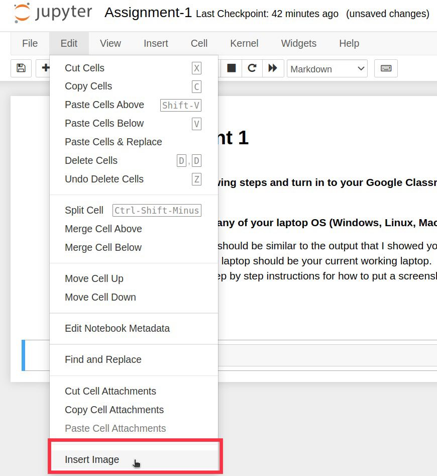
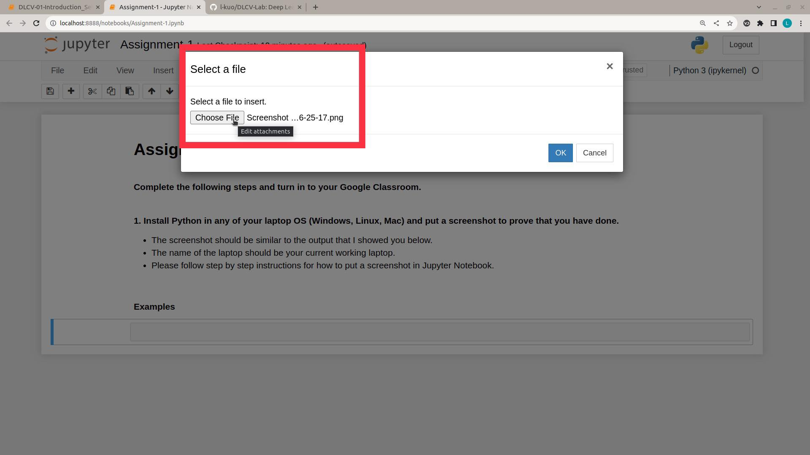
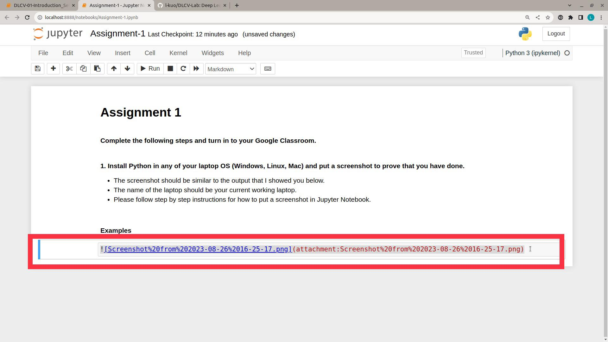

# 00-Introduction, Setup  

## Introduction  
$\textbf{Course}$  
Deep Learning for Computer Vision (Aug 2023)

$\textbf{Programming Language}$  
Python  

$\textbf{Lecturer}$  
Assoc.Prof. Dr.Mongkol Ekpanyapong  

$\textbf{Teaching Assistant}$  
Lin Tun Naing  

$\textbf{Lab Session Outlines}$  
00 - Introduction  
01 - Setup and Python Basics  
02 - Intermediate Python and Pytorch  
03 - Neural Networks and Convolutional Neural Networks  
04 - AlexNet, GoogLeNet  
05 - ResNet  
06 - YOLO  
07 - Mask R-CNN, UNet  
08 - Vision Transformers  
09 - Generative Adversarial Networks  
10 - 3D Convolutional Neural Networks  

$\textbf{References}$  
- https://github.com/Alisa-Kunapinun/Deep-learning-for-Computer-Vision-Aug-2022  from Dr.Alisa Kunapinun
- https://github.com/dsai-asia/RTML/  from Prof.Matthew N. Dailey
- https://www.learnbyexample.org/python-introduction/
- https://www.geeksforgeeks.org/  
- Coursera - Deep Learning Specialization  
- ChatGPT

## Setup  
- If you have Nvidia RTX GPU built-in your laptop, you can use your **Own Laptop** throughout the course.  
- If you don't have Nvidia RTX GPU in your laptop, it is recommended to use your **Google Colab** instead since GPU processing is required in most deep learning trainings.  
- We will use **Python3** throughout the lab. If you have lower versions of Python such as Python2, you have to install Python3 since a lot of syntaxes are different.  
- To install Python3 package in your machine, please follow below instructions according to your OS.

**For Windows Users**
- Check the type of your processor architecture using `systeminfo | find "System Type"`
- Go to https://www.python.org/downloads/windows/ and download the installation package (.exe file) according to your architecture type. 
- You can also check `python` or `python3` in your terminal or command line before installing Python3 in your laptop. It will prompt you to the Python3 interpreter.  
- To exit from Python3 interpreter, simple type `Ctrl+z` or `Ctrl+d`.

 

- While installing Python from `.exe` file, make sure you tick the add Python to PATH box or you will not be able to access Python from the windows terminal.  

 

- Next, you need to install PIP(Preferred Installer Program) in order to easily install python packages. To do so, follow the instructions from https://www.geeksforgeeks.org/how-to-install-pip-on-windows/.

**For Linux Users**
- For Ubuntu users, you don't need to install Python as it has been built-in in OS package already.  
- In order to check whether you have python3 installed, you can check `python` or `python3` command in your terminal and it will prompt you to the Python3 interpreter as shown in below image. Otherwise, you need to install Python3.
- To exit from Python3 interpreter, simple type `Ctrl+z` or `Ctrl+d`.

 

- For installation, go to terminal and run the commands:
    - `sudo apt-get update && sudo apt-get upgrade -y`
    - `sudo apt-get install python3` or if you want to install specific version, type: `sudo apt-get install python3.xx.x`
- To install Python Build Dependencies, run the command:
    - `sudo apt-get build-dep python3`
- You can also install some useful modules by running the command:
    - `sudo apt-get install build-essential gdb lcov libbz2-dev libffi-dev libgdbm-dev liblzma-dev libncurses5-dev libreadline6-dev libsqlite3-dev libssl-dev lzma lzma-dev tk-dev uuid-dev zlib1g-dev`
- Next, you need to install PIP(Preferred Installer Program) in order to easily install python packages. To do so, run the command `sudo apt-get install python-pip` or `sudo apt-get install python3-pip`

**For MacOS Users**
- Please follow the instruction from https://www.datacamp.com/blog/how-to-install-python.  

**For All Users**
- To check Python version in terminal: `python3 --version` or `python3 -v`
- To check PIP version in terminal: `pip3 --version` or `pip3 -v`
- To install a python library or package from pip: `pip3 install package_name`, eg. `pip3 install numpy`
- You can always check the versions and commands in www.pypi.org, eg. https://pypi.org/project/numpy/
- To install jupyter notebook `pip3 install jupyterlab` and `pip3 install notebook`
- To run jupyter notebook, open terminal and go to the directory you want to run jupyter notebook, type the command `jupyter notebook`

**Some Useful Packages You Might Want to Install**
1. numpy
2. pandas
3. matplotlib
4. seaborn
5. opencv
6. setuptools

### How to install Git

Please follow the instruction from below link. Complete until the step 3. If you want to understand more about Git, you can complete all steps but not necessary. 
It is recommended to create the Git account with your own personal email address since you will be using throughout your career even after your degree.  
https://www.freecodecamp.org/news/introduction-to-git-and-github/  

### How to clone a Git Repository

https://git-scm.com/book/en/v2/Git-Basics-Getting-a-Git-Repository

Follow the above link and try cloning my Deep Learning for Computer Vision Lab Repository.  
https://github.com/l-kuo/DLCV-Lab  

### How to put a screenshot in Jupyter Notebook Markdown

The following steps are the easiest way to put a screenshot in your Jupyter Markdown cell.  

##### Step1
- Add a new cell at a location where you want to put the screenshot. Notice that you have to select an existing cell before adding. A new cell will appear just below the cell you selected.

   

##### Step2
- Select the new cell and change the type of the cell by choosing "Markdown" on the task bar dropdown.

   

##### Step3
- Under the "Edit" tab, choose the "Insert Image" while selecting the cell.

   

##### Step4
- Click on "Choose File" and select your screenshot from your local directory. Then click "OK".

   

##### Step5
- When you have selected the screenshot image, the script inside the red rectangle will appear automatically. Once you run the cell, you will get the screenshot image shown in your markdown file.

   

